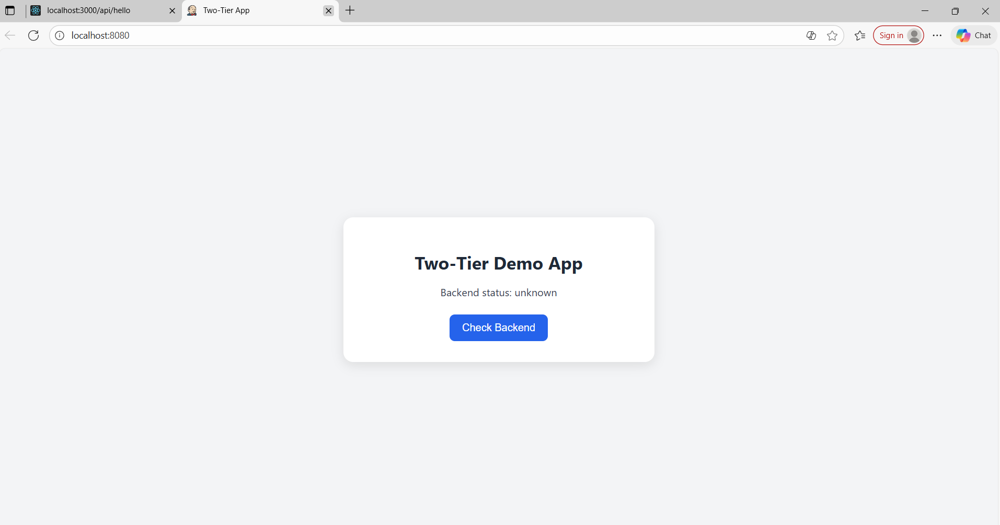
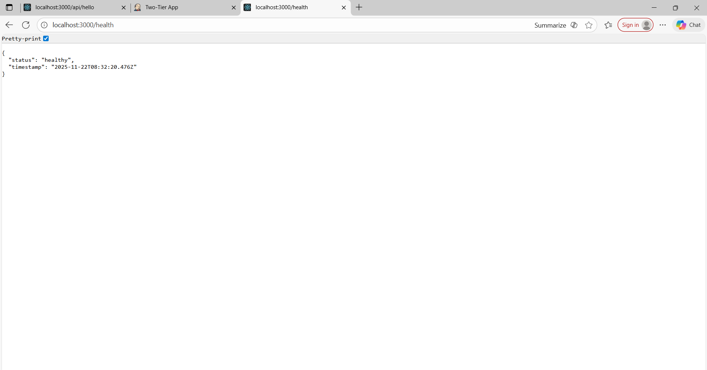
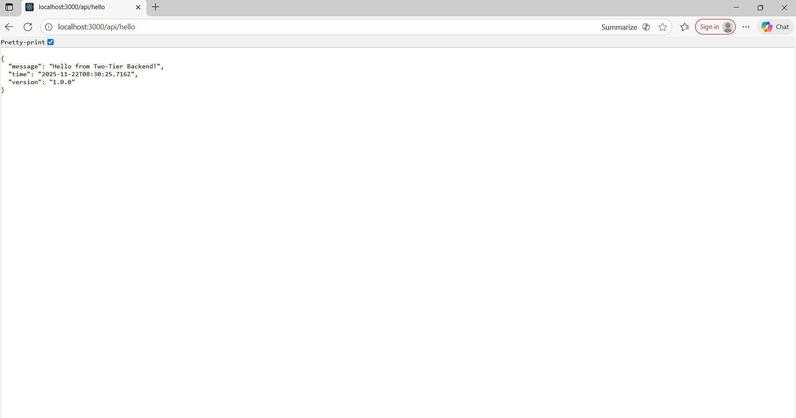
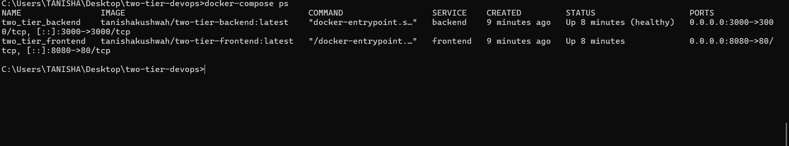
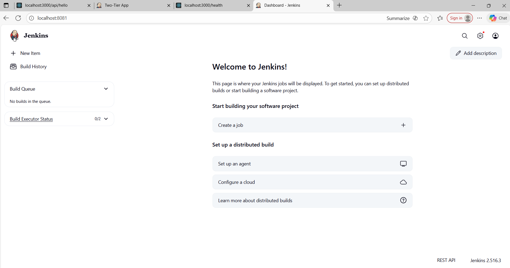

# 🚀 Two-Tier DevOps Application



A modern two-tier web application demonstrating DevOps best practices with Docker, Jenkins CI/CD, and containerized deployment.

## 📋 Table of Contents
- [Architecture](#architecture)
- [Features](#features)
- [Prerequisites](#prerequisites)
- [Quick Start](#quick-start)
- [Development](#development)
- [CI/CD Pipeline](#cicd-pipeline)
- [Deployment](#deployment)
- [API Documentation](#api-documentation)
- [Troubleshooting](#troubleshooting)

## 🏗️ Architecture

```
┌─────────────────┐    ┌─────────────────┐
│   Frontend      │    │    Backend      │
│   (Nginx)       │◄──►│   (Node.js)     │
│   Port: 8080    │    │   Port: 3000    │
└─────────────────┘    └─────────────────┘
```

- **Frontend**: Static HTML/CSS/JS served by Nginx with API proxy
- **Backend**: Node.js Express API server
- **Communication**: Frontend proxies API calls to backend via Nginx
- **Containerization**: Docker containers with Docker Compose orchestration

## ✨ Features

- 🐳 **Containerized Architecture**: Full Docker containerization
- 🔄 **CI/CD Pipeline**: Jenkins automated build and deployment
- 🏥 **Health Checks**: Built-in health monitoring
- 🔒 **Security**: Non-root containers, CORS handling
- 📊 **Monitoring**: Health endpoints and logging
- 🚀 **Auto-deployment**: Docker Compose orchestration
- 🔧 **Development Ready**: Hot reload and debugging support

## 📋 Prerequisites

- Docker & Docker Compose
- Jenkins (for CI/CD)
- Git
- Node.js 18+ (for local development)

## 🚀 Quick Start

### 1. Clone Repository
```bash
git clone <repository-url>
cd two-tier-devops
```

### 2. Environment Setup
```bash
cp .env.example .env
# Edit .env file with your configurations
```

### 3. Build and Run
```bash
# Build and start all services
docker-compose up -d --build

# Check status
docker-compose ps

# View logs
docker-compose logs -f
```

### 4. Access Application
- **Frontend**: http://localhost:8080
- **Backend API**: http://localhost:3000/api/hello
- **Health Check**: http://localhost:3000/health

## 📸 Application Screenshots

### 🌐 Frontend Interface

*Clean, responsive web interface with real-time backend connectivity*

### 🔌 API Response Demo

*Live JSON response showing successful frontend-backend communication*

### 🐳 Docker Containers

*Containerized services running with health checks*

### ⚙️ CI/CD Pipeline

*Automated build, test, and deployment pipeline*

## 💻 Development

### Local Development Setup
```bash
# Backend development
cd backend
npm install
npm start

# Frontend development (serve with live server)
cd frontend
# Open index.html in browser or use live server
```

### Docker Development
```bash
# Build individual services
docker build -t two-tier-backend ./backend
docker build -t two-tier-frontend ./frontend

# Run with development overrides
docker-compose -f docker-compose.yml -f docker-compose.dev.yml up
```

## 🔄 CI/CD Pipeline

### Jenkins Pipeline Stages

1. **Checkout**: Clone repository and clean workspace
2. **Build**: Parallel build of frontend and backend images
3. **Test**: Health check testing of built images
4. **Push**: Push images to Docker registry (main branch only)
5. **Deploy**: Deploy using Docker Compose (main branch only)
6. **Cleanup**: Remove unused Docker resources

### Pipeline Configuration

```groovy
// Key environment variables
IMAGE_BACKEND = "tanishakushwah/two-tier-backend"
IMAGE_FRONTEND = "tanishakushwah/two-tier-frontend"
```

### Required Jenkins Credentials
- `dockerhub-creds`: Docker Hub username/password

## 🚀 Deployment

### Production Deployment
```bash
# Pull latest images
docker-compose pull

# Deploy with zero downtime
docker-compose up -d --no-deps --build frontend backend

# Verify deployment
curl -f http://localhost:8080
curl -f http://localhost:3000/health
```

### Scaling Services
```bash
# Scale backend instances
docker-compose up -d --scale backend=3

# Scale with load balancer (requires additional config)
docker-compose -f docker-compose.yml -f docker-compose.prod.yml up -d
```

## 📚 API Documentation

### Backend Endpoints

#### Health Check
```http
GET /health
```
**Response:**
```json
{
  "status": "healthy",
  "timestamp": "2024-01-15T10:30:00.000Z"
}
```

#### Hello API
```http
GET /api/hello
```
**Response:**
```json
{
  "message": "Hello from Two-Tier Backend!",
  "time": "2024-01-15T10:30:00.000Z",
  "version": "1.0.0"
}
```

## 🔧 Configuration

### Environment Variables

| Variable | Description | Default |
|----------|-------------|---------|
| `BACKEND_PORT` | Backend server port | `3000` |
| `NODE_ENV` | Node environment | `production` |
| `FRONTEND_PORT` | Frontend port mapping | `8080` |

### Docker Compose Services

- **backend**: Node.js API server with health checks
- **frontend**: Nginx web server with API proxy
- **networks**: Isolated bridge network for service communication

## 🐛 Troubleshooting

### Common Issues

#### Frontend can't connect to backend
```bash
# Check if both services are running
docker-compose ps

# Check network connectivity
docker-compose exec frontend ping backend

# Check nginx configuration
docker-compose exec frontend cat /etc/nginx/conf.d/default.conf
```

#### Backend health check failing
```bash
# Check backend logs
docker-compose logs backend

# Test health endpoint directly
curl http://localhost:3000/health

# Check if port is accessible
docker-compose exec backend netstat -tlnp
```

#### Jenkins pipeline failing
```bash
# Check Docker daemon
systemctl status docker

# Verify Jenkins has Docker access
docker ps

# Check credentials
# Ensure 'dockerhub-creds' is configured in Jenkins
```

### Debugging Commands

```bash
# View all logs
docker-compose logs -f

# Execute commands in containers
docker-compose exec backend sh
docker-compose exec frontend sh

# Check resource usage
docker stats

# Inspect networks
docker network ls
docker network inspect two-tier-network
```

## 📊 Monitoring

### Health Monitoring
- Backend health endpoint: `/health`
- Docker health checks configured
- Jenkins pipeline includes health verification

### Logging
```bash
# Application logs
docker-compose logs -f backend
docker-compose logs -f frontend

# System logs
journalctl -u docker
```

## 📝 Project Demo

### 🌐 Live Application Preview


### 🔄 Application Flow
1. **Frontend Loading**: Clean, responsive UI loads at http://localhost:8080
2. **Backend Connection**: Click "Check Backend" to test API connectivity  
3. **Real-time Response**: See live timestamp and message from backend
4. **Health Monitoring**: Backend health checks ensure reliability

### 📊 Expected API Output
```json
{
  "message": "Hello from Two-Tier Backend!",
  "time": "2024-01-15T10:30:00.000Z",
  "version": "1.0.0"
}
```

## 🤝 Contributing

1. Fork the repository
2. Create feature branch (`git checkout -b feature/amazing-feature`)
3. Commit changes (`git commit -m 'Add amazing feature'`)
4. Push to branch (`git push origin feature/amazing-feature`)
5. Open Pull Request

## 📄 License

This project is licensed under the MIT License - see the [LICENSE](LICENSE) file for details.

## 👨‍💻 Author

**Tanisha Kushwah**
- GitHub: [@tanishakushwah](https://github.com/tanishakushwah)
- Docker Hub: [tanishakushwah](https://hub.docker.com/u/tanishakushwah)

---

## 🎯 Next Steps

- [ ] Add database integration (PostgreSQL/MongoDB)
- [ ] Implement authentication and authorization
- [ ] Add monitoring with Prometheus/Grafana
- [ ] Set up log aggregation with ELK stack
- [ ] Add automated testing (unit, integration, e2e)
- [ ] Implement blue-green deployment
- [ ] Add Kubernetes manifests
- [ ] Set up SSL/TLS certificates

---

**Happy Coding! 🚀**
